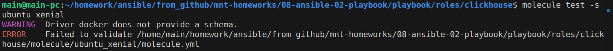
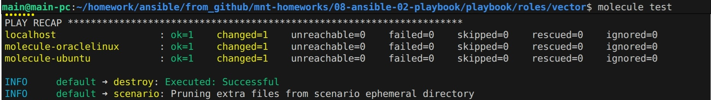
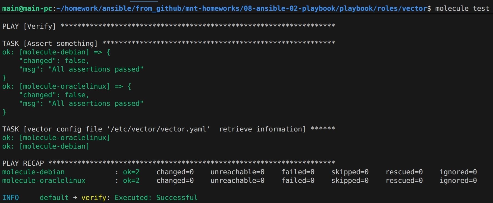
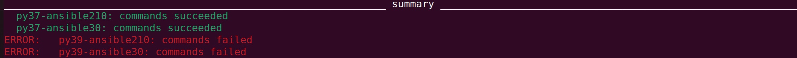

## Решение

### Molecule
1. Запуск  `molecule test -s ubuntu_xenial`:

2. Запуск тестирования роли vector:

3. Добавление assert в verify.yml и повторное тестирование:

4. Добавление нового тэга:
https://github.com/cranberry511/ansible-vector-role/tree/1.0.1

### Tox
Для запуска был использован контейнер с tox на основе собственного образа (Dockerfile приложен)
https://github.com/cranberry511/ansible-vector-role/tree/1.0.2

1. Запуск tox:

